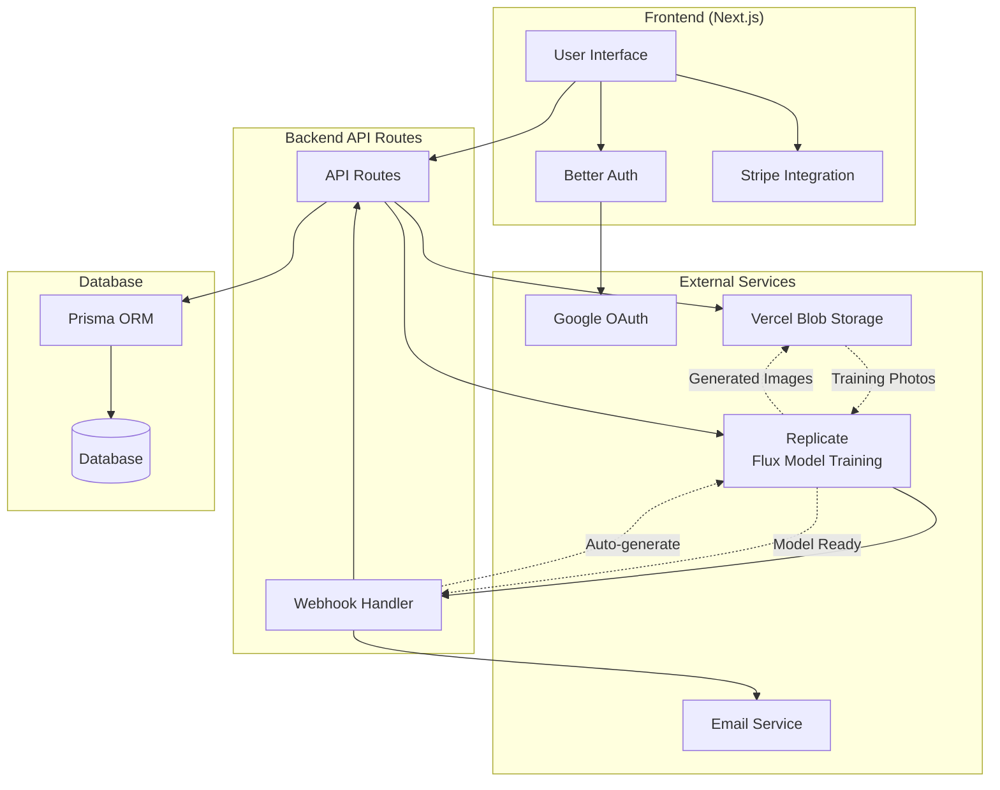

# Amazing Photos

> An open-source AI image generation tool for creating personalized AI models and custom images

[](https://amazing.photos)
[](https://choosealicense.com/licenses/mit/)
[](https://nextjs.org/)

## ✨ Features

* **🆓 Free Generations** - Try the platform with pre-trained models before subscribing
* **⚡ Fast AI Training** - Create your personalized model in ~2 minutes using H100 GPUs
* **🎨 Custom Image Generation** - Generate images with any prompt in ~20 seconds
* **🔓 Uncensored** - No content restrictions on image generation
* **🔐 Google Authentication** - Quick and secure sign-in
* **📧 Email Notifications** - Automatic updates via Resend

## 🛠️ Tech Stack

| Category | Technology |
|----------|------------|
| **Frontend** | Next.js, TypeScript, Tailwind CSS |
| **Authentication** | Better Auth |
| **Payments** | Stripe |
| **AI Training** | Flux models (via Replicate) |
| **Storage** | Vercel Blob |
| **Database** | Prisma |
| **Hosting** | Vercel |

## 🚀 How It Works



### User Flow

1. **Upload Photos** - Users upload training images
2. **Model Training** - Images sent to Replicate for Flux model training
3. **Auto-Generation** - 15 starter images automatically generated
4. **Custom Prompts** - Users generate new images with custom prompts
5. **Download & Share** - Save and use generated images

## 🏃‍♂️ Quick start locally

### Prerequisites

* Node.js 18+
* pnpm package manager

### Installation

1. **Clone the repository**

```bash
   git clone https://github.com/your-username/amazing-photos.git
   cd amazing-photos
   ```

2. **Install dependencies**

```bash
   pnpm install
   ```

3. **Setup environment variables**

```bash
   cp .env.example .env
   # Add your API keys and configuration
   ```

4. **Run development server**

```bash
   pnpm dev
   ```

Open [http://localhost:3000](http://localhost:3000) in your browser.

## ⚙️ Configuration

### Stripe Payments

Create products with price IDs in your Stripe dashboard.

For detailed setup instructions, see my free guide: [How to add Stripe to Next.js in 5 minutes 💰](https://tomdekan.com/articles/stripe-with-nextjs).

For local testing:

```bash
stripe listen --forward-to localhost:3000/api/webhook
```

### Replicate Webhooks

Create a tunnel for training completion webhooks:

```bash
ssh -R 80:localhost:3000 ssh.localhost.run
```

### Google Authentication

Set up Google OAuth credentials and add them to your `.env` file.

For detailed setup instructions, see my guide [The simplest way to add Google sign-in to your Next.js app](https://tomdekan.com/articles/google-sign-in-nextjs).

## 🤝 Contributing

Contributions are welcome! Please feel free to submit a Pull Request. For major changes, please open an issue first to discuss what you would like to change.

## 📝 License

This project is licensed under the MIT License - see the [LICENSE](LICENSE) file for details.

## 📞 Support

* Try the hosted version at [amazing.photos](https://amazing.photos)
* Create an issue for bug reports or feature requests
* Check out the [documentation](https://tomdekan.com/articles/google-sign-in-nextjs) for setup guides

## 🗺️ Roadmap

### Priority

* [ ] Require TOK token in prompts (this is the default model identifier)

### Nice to Have

* [ ] Show examples with the free demo model
* [ ] Add example prompts gallery
* [ ] Implement parallel image generation
* [ ] Add contact support system

---

<div align="center">
  <p>Built with 🥕 by <a href="https://tomdekan.com">Tom Dekan</a></p>
  <p>⭐ Star this repo if you found it helpful!</p>
</div>
