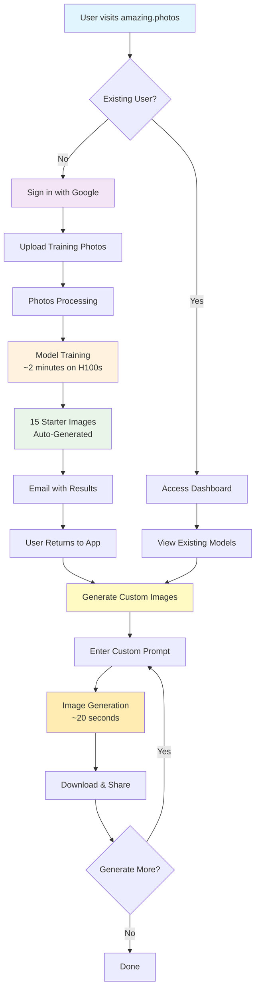
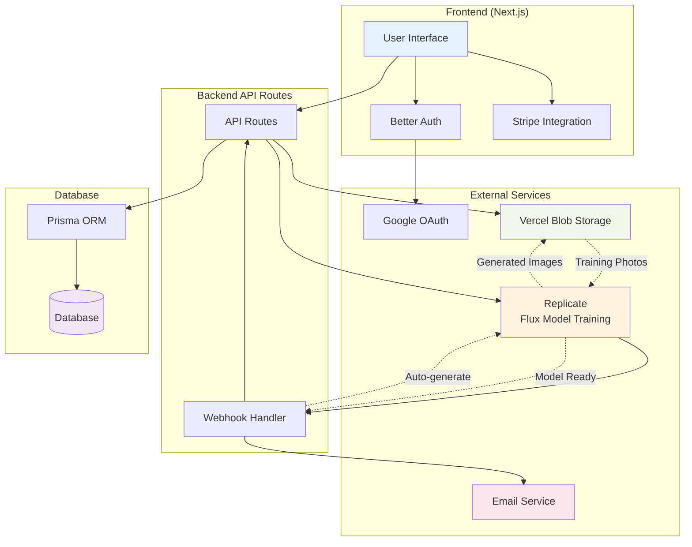

# Amazing Photos

Amazing.photos An open-source AI image generation tool that allows users to train personalized AI models and generate custom images.

🌐 The cloud version is ready to use here! [amazing.photos](https://amazing.photos)

## Overview

Amazing Photos lets users upload their photos to train a personalized AI model, then generate unlimited custom images of themselves using any prompt. The app uses state-of-the-art Flux models for fast, high-quality results.

## Features

* **Free Generations**: Free generations using full pre-trained modes (trained on me) before subscribing
* **Personalized AI Training**: Upload photos to create your own AI model (Training is very fast: ~2 minutes using H100s)
* **Custom Image Generation**: Generate images with any prompt (Roughly ~20 seconds per geneartion)
* **Uncensored: No Content Restrictions**: Generate any type of image
* **Google Authentication**: Quick sign-in process
* **Automatic Email Delivery**: Receive generated images via email

## Tech Stack

* **Frontend**: Next.js, TypeScript, Tailwind CSS
* **Authentication**: Better Auth
* **Payments**: Stripe
* **AI Training**: Replicate (Flux models)
* **Storage**: Vercel Blob
* **Database**: Prisma
* **Hosting**: Vercel

## Quick Start locally

01. **Clone the repository**

```bash
   git clone https://github.com/your-username/amazing-photos.git
   cd amazing-photos
   ```

02. **Install dependencies**

```bash
   pnpm install
   ```

03. **Setup environment variables**

```bash
   cp .env.example .env
   # Add your API keys and configuration
   ```

04. **Run development server**

```bash
   pnpm dev
   ```

## Configuration

### Stripe Payments

Create products with price IDs in your Stripe dashboard. For local testing:

```bash
stripe listen --forward-to localhost:3000/api/webhook
```

### Replicate Webhooks

Create a tunnel for training completion webhooks:

```bash
ssh -R 80:localhost:3000 ssh.localhost.run
```

### Google Authentication

You just need to add

Any problems? See my my guide on [Google Sign-in with Next.js](https://tomdekan.com/articles/google-sign-in-nextjs) for setup.

## How It Works

01. **Upload Photos**: Users upload training images
02. **Model Training**: Images sent to Replicate for Flux model training
03. **Auto-Generation**: 15 starter images automatically generated
04. **Custom Prompts**: Users generate new images with custom prompts
05. **Download & Share**: Save and use generated images

## Flow Diagrams

### User Journey



### Technical Architecture



## Contributing

Contributions welcome! Submit pull requests for new features or improvements.

## License

MIT License - feel free to fork and modify for your own use.

## Support

Try the hosted version at [amazing.photos](https://amazing.photos) or contact for support.

## Roaddmap

Priority:
1 [ ] Require TOK in the prompt (This is the default identifier for the model)

Nice to have:
02. [ ] SHow a model with examples to the free Tom model
03. [ ] Add some example prompts
04. [ ] Add a contact email for support
05. [ ] Allow users to generate images in parallel
